# Fontes PlantUML da solução

Os diagramas renderizados e a descrição dos cenários estão na [Wiki da N2](https://github.com/Felipevhonorato/ProjSoft-Entrega1---Prot-tipo-Sequencia-de-telas-e-Lista-de-classes-candidatas-Identificadas/wiki/Entrega-N2-Modelagem-de-Projeto). Copie um bloco para um arquivo .puml para editá-lo ou renderizá-lo.

## 01

Abrir fonte

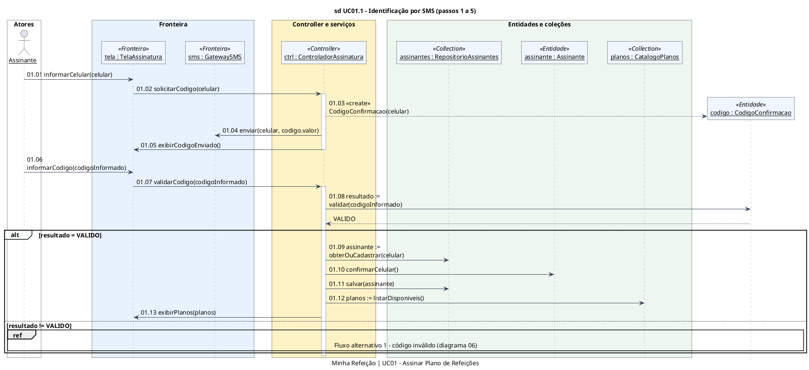
```plantuml
@startuml
skinparam backgroundColor #FFFFFF
skinparam defaultFontName Arial
skinparam defaultFontSize 14
skinparam shadowing false
skinparam roundcorner 0
skinparam ArrowColor #334155
skinparam sequenceMessageAlign left
skinparam sequenceParticipant underline
skinparam maxMessageSize 260
skinparam ParticipantPadding 18
skinparam BoxPadding 12
skinparam classAttributeIconSize 0
skinparam classBackgroundColor #F8FAFC
skinparam classBorderColor #475569
skinparam sequenceLifeLineBorderColor #94A3B8
skinparam sequenceParticipantBackgroundColor #EFF6FF
skinparam sequenceGroupBackgroundColor #F8FAFC
hide footbox

title sd UC01.1 - Identificação por SMS (passos 1 a 5)
caption Minha Refeição | UC01 - Assinar Plano de Refeições
box "Atores" #FFFFFF
actor "Assinante" as u
end box
box "Fronteira" #E8F2FF
participant "tela : TelaAssinatura" as t <<Fronteira>>
participant "sms : GatewaySMS" as sms <<Fronteira>>
end box
box "Controller e serviços" #FEF3C7
participant "ctrl : ControladorAssinatura" as c <<Controller>>
end box
box "Entidades e coleções" #EDF7F0
participant "assinantes : RepositorioAssinantes" as ra <<Collection>>
participant "assinante : Assinante" as a <<Entidade>>
participant "planos : CatalogoPlanos" as cp <<Collection>>
end box
u -> t : 01.01 informarCelular(celular)
t -> c : 01.02 solicitarCodigo(celular)
activate c
create participant "codigo : CodigoConfirmacao" as cod <<Entidade>>
c --> cod : 01.03 «create» CodigoConfirmacao(celular)
c -> sms : 01.04 enviar(celular, codigo.valor)
c -> t : 01.05 exibirCodigoEnviado()
deactivate c
u -> t : 01.06 informarCodigo(codigoInformado)
t -> c : 01.07 validarCodigo(codigoInformado)
activate c
c -> cod : 01.08 resultado := validar(codigoInformado)
cod --> c : VALIDO
alt resultado = VALIDO
c -> ra : 01.09 assinante := obterOuCadastrar(celular)
c -> a : 01.10 confirmarCelular()
c -> ra : 01.11 salvar(assinante)
c -> cp : 01.12 planos := listarDisponiveis()
c -> t : 01.13 exibirPlanos(planos)
else resultado != VALIDO
ref over u,c,cod : Fluxo alternativo 1 - código inválido (diagrama 06)
end
deactivate c
@enduml
```

## 02

Abrir fonte

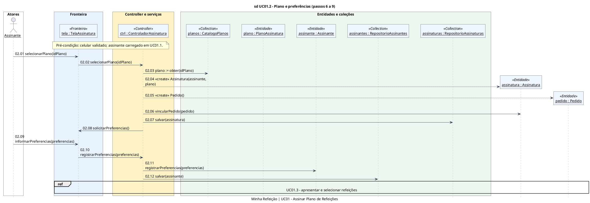
```plantuml
@startuml
skinparam backgroundColor #FFFFFF
skinparam defaultFontName Arial
skinparam defaultFontSize 14
skinparam shadowing false
skinparam roundcorner 0
skinparam ArrowColor #334155
skinparam sequenceMessageAlign left
skinparam sequenceParticipant underline
skinparam maxMessageSize 260
skinparam ParticipantPadding 18
skinparam BoxPadding 12
skinparam classAttributeIconSize 0
skinparam classBackgroundColor #F8FAFC
skinparam classBorderColor #475569
skinparam sequenceLifeLineBorderColor #94A3B8
skinparam sequenceParticipantBackgroundColor #EFF6FF
skinparam sequenceGroupBackgroundColor #F8FAFC
hide footbox

title sd UC01.2 - Plano e preferências (passos 6 a 9)
caption Minha Refeição | UC01 - Assinar Plano de Refeições
box "Atores" #FFFFFF
actor "Assinante" as u
end box
box "Fronteira" #E8F2FF
participant "tela : TelaAssinatura" as t <<Fronteira>>
end box
box "Controller e serviços" #FEF3C7
participant "ctrl : ControladorAssinatura" as c <<Controller>>
end box
box "Entidades e coleções" #EDF7F0
participant "planos : CatalogoPlanos" as cp <<Collection>>
participant "plano : PlanoAssinatura" as pl <<Entidade>>
participant "assinante : Assinante" as a <<Entidade>>
participant "assinantes : RepositorioAssinantes" as ra <<Collection>>
participant "assinaturas : RepositorioAssinaturas" as rs <<Collection>>
end box
note over t,c : Pré-condição: celular validado; assinante carregado em UC01.1.
u -> t : 02.01 selecionarPlano(idPlano)
t -> c : 02.02 selecionarPlano(idPlano)
c -> cp : 02.03 plano := obter(idPlano)
create participant "assinatura : Assinatura" as s <<Entidade>>
c --> s : 02.04 «create» Assinatura(assinante, plano)
create participant "pedido : Pedido" as p <<Entidade>>
c --> p : 02.05 «create» Pedido()
c -> s : 02.06 vincularPedido(pedido)
c -> rs : 02.07 salvar(assinatura)
c -> t : 02.08 solicitarPreferencias()
u -> t : 02.09 informarPreferencias(preferencias)
t -> c : 02.10 registrarPreferencias(preferencias)
c -> a : 02.11 registrarPreferencias(preferencias)
c -> ra : 02.12 salvar(assinante)
ref over t,c,p : UC01.3 - apresentar e selecionar refeições
@enduml
```

## 03

Abrir fonte

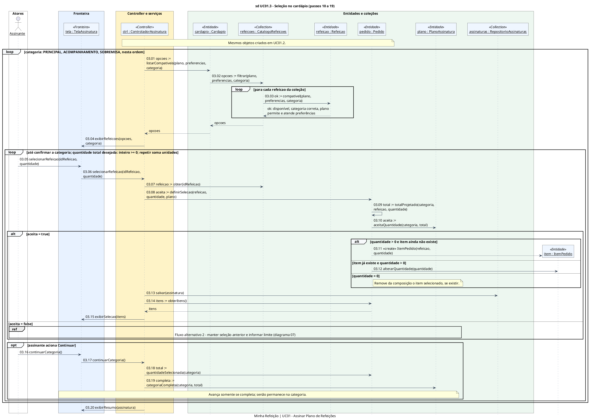
```plantuml
@startuml
skinparam backgroundColor #FFFFFF
skinparam defaultFontName Arial
skinparam defaultFontSize 14
skinparam shadowing false
skinparam roundcorner 0
skinparam ArrowColor #334155
skinparam sequenceMessageAlign left
skinparam sequenceParticipant underline
skinparam maxMessageSize 260
skinparam ParticipantPadding 18
skinparam BoxPadding 12
skinparam classAttributeIconSize 0
skinparam classBackgroundColor #F8FAFC
skinparam classBorderColor #475569
skinparam sequenceLifeLineBorderColor #94A3B8
skinparam sequenceParticipantBackgroundColor #EFF6FF
skinparam sequenceGroupBackgroundColor #F8FAFC
hide footbox

title sd UC01.3 - Seleção no cardápio (passos 10 a 19)
caption Minha Refeição | UC01 - Assinar Plano de Refeições
box "Atores" #FFFFFF
actor "Assinante" as u
end box
box "Fronteira" #E8F2FF
participant "tela : TelaAssinatura" as t <<Fronteira>>
end box
box "Controller e serviços" #FEF3C7
participant "ctrl : ControladorAssinatura" as c <<Controller>>
end box
box "Entidades e coleções" #EDF7F0
participant "cardapio : Cardapio" as ca <<Entidade>>
participant "refeicoes : CatalogoRefeicoes" as cr <<Collection>>
participant "refeicao : Refeicao" as r <<Entidade>>
participant "pedido : Pedido" as p <<Entidade>>
participant "plano : PlanoAssinatura" as pl <<Entidade>>
participant "assinaturas : RepositorioAssinaturas" as rs <<Collection>>
end box
note over c,p : Mesmos objetos criados em UC01.2.
loop categoria: PRINCIPAL, ACOMPANHAMENTO, SOBREMESA, nesta ordem
c -> ca : 03.01 opcoes := listarCompativeis(plano, preferencias, categoria)
ca -> cr : 03.02 opcoes := filtrar(plano, preferencias, categoria)
loop para cada refeicao da coleção
cr -> r : 03.03 ok := compativel(plano, preferencias, categoria)
r --> cr : ok: disponível, categoria correta, plano permite e atende preferências
end
cr --> ca : opcoes
ca --> c : opcoes
c -> t : 03.04 exibirRefeicoes(opcoes, categoria)
loop até confirmar a categoria; quantidade total desejada: inteiro >= 0; repetir soma unidades
u -> t : 03.05 selecionarRefeicao(idRefeicao, quantidade)
t -> c : 03.06 selecionarRefeicao(idRefeicao, quantidade)
c -> cr : 03.07 refeicao := obter(idRefeicao)
c -> p : 03.08 aceita := definirSelecao(refeicao, quantidade, plano)
p -> p : 03.09 total := totalProjetado(categoria, refeicao, quantidade)
p -> pl : 03.10 aceita := aceitaQuantidade(categoria, total)
alt aceita = true
alt quantidade > 0 e item ainda não existe
create participant "item : ItemPedido" as i <<Entidade>>
p --> i : 03.11 «create» ItemPedido(refeicao, quantidade)
else item já existe e quantidade > 0
p -> i : 03.12 alterarQuantidade(quantidade)
else quantidade = 0
note right of p : Remove da composição o item selecionado, se existir.
end
c -> rs : 03.13 salvar(assinatura)
c -> p : 03.14 itens := obterItens()
p --> c : itens
c -> t : 03.15 exibirSelecao(itens)
else aceita = false
ref over u,t,c,p,pl : Fluxo alternativo 2 - manter seleção anterior e informar limite (diagrama 07)
end
opt assinante aciona Continuar
u -> t : 03.16 continuarCategoria()
t -> c : 03.17 continuarCategoria()
c -> p : 03.18 total := quantidadeSelecionada(categoria)
c -> pl : 03.19 completa := categoriaCompleta(categoria, total)
note over t,pl : Avança somente se completa; senão permanece na categoria.
end
end
end
c -> t : 03.20 exibirResumo(assinatura)
@enduml
```

## 04

Abrir fonte

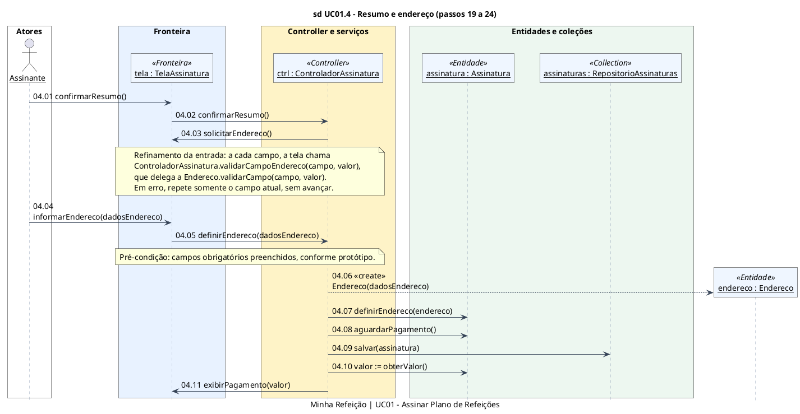
```plantuml
@startuml
skinparam backgroundColor #FFFFFF
skinparam defaultFontName Arial
skinparam defaultFontSize 14
skinparam shadowing false
skinparam roundcorner 0
skinparam ArrowColor #334155
skinparam sequenceMessageAlign left
skinparam sequenceParticipant underline
skinparam maxMessageSize 260
skinparam ParticipantPadding 18
skinparam BoxPadding 12
skinparam classAttributeIconSize 0
skinparam classBackgroundColor #F8FAFC
skinparam classBorderColor #475569
skinparam sequenceLifeLineBorderColor #94A3B8
skinparam sequenceParticipantBackgroundColor #EFF6FF
skinparam sequenceGroupBackgroundColor #F8FAFC
hide footbox

title sd UC01.4 - Resumo e endereço (passos 19 a 24)
caption Minha Refeição | UC01 - Assinar Plano de Refeições
box "Atores" #FFFFFF
actor "Assinante" as u
end box
box "Fronteira" #E8F2FF
participant "tela : TelaAssinatura" as t <<Fronteira>>
end box
box "Controller e serviços" #FEF3C7
participant "ctrl : ControladorAssinatura" as c <<Controller>>
end box
box "Entidades e coleções" #EDF7F0
participant "assinatura : Assinatura" as s <<Entidade>>
participant "assinaturas : RepositorioAssinaturas" as rs <<Collection>>
end box
u -> t : 04.01 confirmarResumo()
t -> c : 04.02 confirmarResumo()
c -> t : 04.03 solicitarEndereco()
note over t,c
Refinamento da entrada: a cada campo, a tela chama
ControladorAssinatura.validarCampoEndereco(campo, valor),
que delega a Endereco.validarCampo(campo, valor).
Em erro, repete somente o campo atual, sem avançar.
end note
u -> t : 04.04 informarEndereco(dadosEndereco)
t -> c : 04.05 definirEndereco(dadosEndereco)
note over t,c : Pré-condição: campos obrigatórios preenchidos, conforme protótipo.
create participant "endereco : Endereco" as e <<Entidade>>
c --> e : 04.06 «create» Endereco(dadosEndereco)
c -> s : 04.07 definirEndereco(endereco)
c -> s : 04.08 aguardarPagamento()
c -> rs : 04.09 salvar(assinatura)
c -> s : 04.10 valor := obterValor()
c -> t : 04.11 exibirPagamento(valor)
@enduml
```

## 05

Abrir fonte

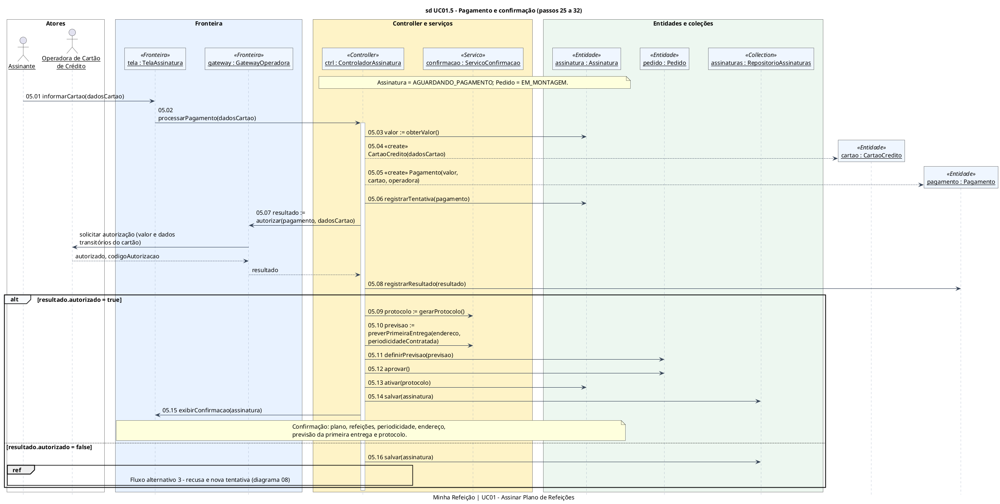
```plantuml
@startuml
skinparam backgroundColor #FFFFFF
skinparam defaultFontName Arial
skinparam defaultFontSize 14
skinparam shadowing false
skinparam roundcorner 0
skinparam ArrowColor #334155
skinparam sequenceMessageAlign left
skinparam sequenceParticipant underline
skinparam maxMessageSize 260
skinparam ParticipantPadding 18
skinparam BoxPadding 12
skinparam classAttributeIconSize 0
skinparam classBackgroundColor #F8FAFC
skinparam classBorderColor #475569
skinparam sequenceLifeLineBorderColor #94A3B8
skinparam sequenceParticipantBackgroundColor #EFF6FF
skinparam sequenceGroupBackgroundColor #F8FAFC
hide footbox

title sd UC01.5 - Pagamento e confirmação (passos 25 a 32)
caption Minha Refeição | UC01 - Assinar Plano de Refeições
box "Atores" #FFFFFF
actor "Assinante" as u
actor "Operadora de Cartão\nde Crédito" as oper
end box
box "Fronteira" #E8F2FF
participant "tela : TelaAssinatura" as t <<Fronteira>>
participant "gateway : GatewayOperadora" as gw <<Fronteira>>
end box
box "Controller e serviços" #FEF3C7
participant "ctrl : ControladorAssinatura" as c <<Controller>>
participant "confirmacao : ServicoConfirmacao" as sc <<Servico>>
end box
box "Entidades e coleções" #EDF7F0
participant "assinatura : Assinatura" as s <<Entidade>>
participant "pedido : Pedido" as p <<Entidade>>
participant "assinaturas : RepositorioAssinaturas" as rs <<Collection>>
end box
note over c,s : Assinatura = AGUARDANDO_PAGAMENTO; Pedido = EM_MONTAGEM.
u -> t : 05.01 informarCartao(dadosCartao)
t -> c : 05.02 processarPagamento(dadosCartao)
activate c
c -> s : 05.03 valor := obterValor()
create participant "cartao : CartaoCredito" as cc <<Entidade>>
c --> cc : 05.04 «create» CartaoCredito(dadosCartao)
create participant "pagamento : Pagamento" as pg <<Entidade>>
c --> pg : 05.05 «create» Pagamento(valor, cartao, operadora)
c -> s : 05.06 registrarTentativa(pagamento)
c -> gw : 05.07 resultado := autorizar(pagamento, dadosCartao)
gw -> oper : solicitar autorização (valor e dados transitórios do cartão)
oper --> gw : autorizado, codigoAutorizacao
gw --> c : resultado
c -> pg : 05.08 registrarResultado(resultado)
alt resultado.autorizado = true
c -> sc : 05.09 protocolo := gerarProtocolo()
c -> sc : 05.10 previsao := preverPrimeiraEntrega(endereco, periodicidadeContratada)
c -> p : 05.11 definirPrevisao(previsao)
c -> p : 05.12 aprovar()
c -> s : 05.13 ativar(protocolo)
c -> rs : 05.14 salvar(assinatura)
c -> t : 05.15 exibirConfirmacao(assinatura)
note over t,s : Confirmação: plano, refeições, periodicidade, endereço,\nprevisão da primeira entrega e protocolo.
else resultado.autorizado = false
c -> rs : 05.16 salvar(assinatura)
ref over u,t,c : Fluxo alternativo 3 - recusa e nova tentativa (diagrama 08)
end
deactivate c
@enduml
```

## 06

Abrir fonte

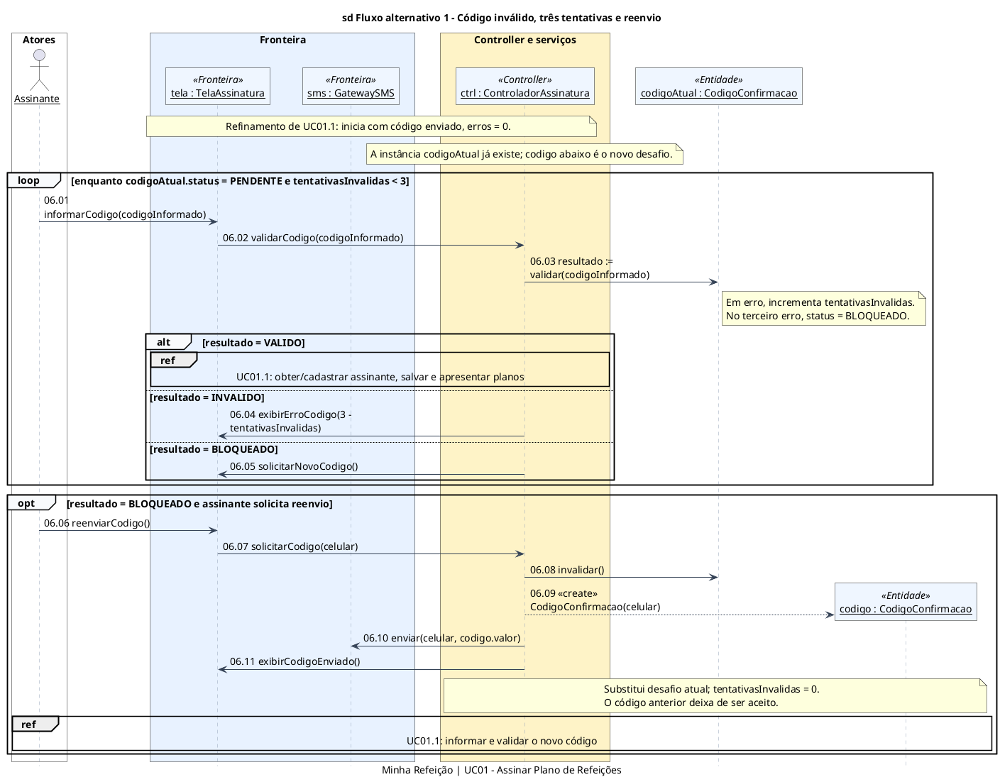
```plantuml
@startuml
skinparam backgroundColor #FFFFFF
skinparam defaultFontName Arial
skinparam defaultFontSize 14
skinparam shadowing false
skinparam roundcorner 0
skinparam ArrowColor #334155
skinparam sequenceMessageAlign left
skinparam sequenceParticipant underline
skinparam maxMessageSize 260
skinparam ParticipantPadding 18
skinparam BoxPadding 12
skinparam classAttributeIconSize 0
skinparam classBackgroundColor #F8FAFC
skinparam classBorderColor #475569
skinparam sequenceLifeLineBorderColor #94A3B8
skinparam sequenceParticipantBackgroundColor #EFF6FF
skinparam sequenceGroupBackgroundColor #F8FAFC
hide footbox

title sd Fluxo alternativo 1 - Código inválido, três tentativas e reenvio
caption Minha Refeição | UC01 - Assinar Plano de Refeições
box "Atores" #FFFFFF
actor "Assinante" as u
end box
box "Fronteira" #E8F2FF
participant "tela : TelaAssinatura" as t <<Fronteira>>
participant "sms : GatewaySMS" as sms <<Fronteira>>
end box
box "Controller e serviços" #FEF3C7
participant "ctrl : ControladorAssinatura" as c <<Controller>>
end box
note over t,c : Refinamento de UC01.1: inicia com código enviado, erros = 0.
note over c : A instância codigoAtual já existe; codigo abaixo é o novo desafio.
participant "codigoAtual : CodigoConfirmacao" as atual <<Entidade>>
loop enquanto codigoAtual.status = PENDENTE e tentativasInvalidas < 3
u -> t : 06.01 informarCodigo(codigoInformado)
t -> c : 06.02 validarCodigo(codigoInformado)
c -> atual : 06.03 resultado := validar(codigoInformado)
note right of atual : Em erro, incrementa tentativasInvalidas.\nNo terceiro erro, status = BLOQUEADO.
alt resultado = VALIDO
ref over t,c : UC01.1: obter/cadastrar assinante, salvar e apresentar planos
else resultado = INVALIDO
c -> t : 06.04 exibirErroCodigo(3 - tentativasInvalidas)
else resultado = BLOQUEADO
c -> t : 06.05 solicitarNovoCodigo()
end
end
opt resultado = BLOQUEADO e assinante solicita reenvio
u -> t : 06.06 reenviarCodigo()
t -> c : 06.07 solicitarCodigo(celular)
c -> atual : 06.08 invalidar()
create participant "codigo : CodigoConfirmacao" as cod <<Entidade>>
c --> cod : 06.09 «create» CodigoConfirmacao(celular)
c -> sms : 06.10 enviar(celular, codigo.valor)
c -> t : 06.11 exibirCodigoEnviado()
note over c,cod : Substitui desafio atual; tentativasInvalidas = 0.\nO código anterior deixa de ser aceito.
ref over u,t,c,cod : UC01.1: informar e validar o novo código
end
@enduml
```

## 07

Abrir fonte

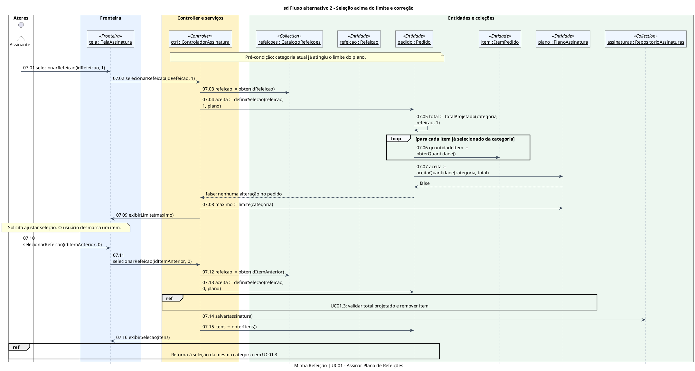
```plantuml
@startuml
skinparam backgroundColor #FFFFFF
skinparam defaultFontName Arial
skinparam defaultFontSize 14
skinparam shadowing false
skinparam roundcorner 0
skinparam ArrowColor #334155
skinparam sequenceMessageAlign left
skinparam sequenceParticipant underline
skinparam maxMessageSize 260
skinparam ParticipantPadding 18
skinparam BoxPadding 12
skinparam classAttributeIconSize 0
skinparam classBackgroundColor #F8FAFC
skinparam classBorderColor #475569
skinparam sequenceLifeLineBorderColor #94A3B8
skinparam sequenceParticipantBackgroundColor #EFF6FF
skinparam sequenceGroupBackgroundColor #F8FAFC
hide footbox

title sd Fluxo alternativo 2 - Seleção acima do limite e correção
caption Minha Refeição | UC01 - Assinar Plano de Refeições
box "Atores" #FFFFFF
actor "Assinante" as u
end box
box "Fronteira" #E8F2FF
participant "tela : TelaAssinatura" as t <<Fronteira>>
end box
box "Controller e serviços" #FEF3C7
participant "ctrl : ControladorAssinatura" as c <<Controller>>
end box
box "Entidades e coleções" #EDF7F0
participant "refeicoes : CatalogoRefeicoes" as cr <<Collection>>
participant "refeicao : Refeicao" as r <<Entidade>>
participant "pedido : Pedido" as p <<Entidade>>
participant "item : ItemPedido" as i <<Entidade>>
participant "plano : PlanoAssinatura" as pl <<Entidade>>
participant "assinaturas : RepositorioAssinaturas" as rs <<Collection>>
end box
note over c,p : Pré-condição: categoria atual já atingiu o limite do plano.
u -> t : 07.01 selecionarRefeicao(idRefeicao, 1)
t -> c : 07.02 selecionarRefeicao(idRefeicao, 1)
c -> cr : 07.03 refeicao := obter(idRefeicao)
c -> p : 07.04 aceita := definirSelecao(refeicao, 1, plano)
p -> p : 07.05 total := totalProjetado(categoria, refeicao, 1)
loop para cada item já selecionado da categoria
p -> i : 07.06 quantidadeItem := obterQuantidade()
end
p -> pl : 07.07 aceita := aceitaQuantidade(categoria, total)
pl --> p : false
p --> c : false; nenhuma alteração no pedido
c -> pl : 07.08 maximo := limite(categoria)
c -> t : 07.09 exibirLimite(maximo)
note over u,t : Solicita ajustar seleção. O usuário desmarca um item.
u -> t : 07.10 selecionarRefeicao(idItemAnterior, 0)
t -> c : 07.11 selecionarRefeicao(idItemAnterior, 0)
c -> cr : 07.12 refeicao := obter(idItemAnterior)
c -> p : 07.13 aceita := definirSelecao(refeicao, 0, plano)
ref over c,p,pl : UC01.3: validar total projetado e remover item
c -> rs : 07.14 salvar(assinatura)
c -> p : 07.15 itens := obterItens()
c -> t : 07.16 exibirSelecao(itens)
ref over u,t,c,p : Retorna à seleção da mesma categoria em UC01.3
@enduml
```

## 08

Abrir fonte

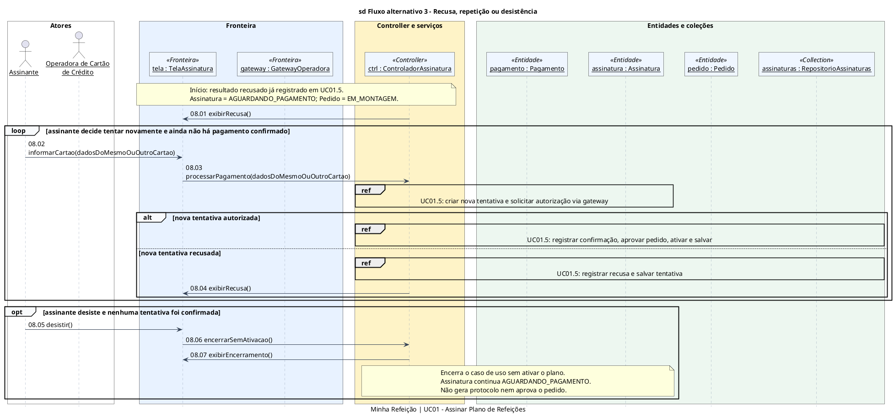
```plantuml
@startuml
skinparam backgroundColor #FFFFFF
skinparam defaultFontName Arial
skinparam defaultFontSize 14
skinparam shadowing false
skinparam roundcorner 0
skinparam ArrowColor #334155
skinparam sequenceMessageAlign left
skinparam sequenceParticipant underline
skinparam maxMessageSize 260
skinparam ParticipantPadding 18
skinparam BoxPadding 12
skinparam classAttributeIconSize 0
skinparam classBackgroundColor #F8FAFC
skinparam classBorderColor #475569
skinparam sequenceLifeLineBorderColor #94A3B8
skinparam sequenceParticipantBackgroundColor #EFF6FF
skinparam sequenceGroupBackgroundColor #F8FAFC
hide footbox

title sd Fluxo alternativo 3 - Recusa, repetição ou desistência
caption Minha Refeição | UC01 - Assinar Plano de Refeições
box "Atores" #FFFFFF
actor "Assinante" as u
actor "Operadora de Cartão\nde Crédito" as oper
end box
box "Fronteira" #E8F2FF
participant "tela : TelaAssinatura" as t <<Fronteira>>
participant "gateway : GatewayOperadora" as gw <<Fronteira>>
end box
box "Controller e serviços" #FEF3C7
participant "ctrl : ControladorAssinatura" as c <<Controller>>
end box
box "Entidades e coleções" #EDF7F0
participant "pagamento : Pagamento" as pg <<Entidade>>
participant "assinatura : Assinatura" as s <<Entidade>>
participant "pedido : Pedido" as p <<Entidade>>
participant "assinaturas : RepositorioAssinaturas" as rs <<Collection>>
end box
note over t,c : Início: resultado recusado já registrado em UC01.5.\nAssinatura = AGUARDANDO_PAGAMENTO; Pedido = EM_MONTAGEM.
c -> t : 08.01 exibirRecusa()
loop assinante decide tentar novamente e ainda não há pagamento confirmado
u -> t : 08.02 informarCartao(dadosDoMesmoOuOutroCartao)
t -> c : 08.03 processarPagamento(dadosDoMesmoOuOutroCartao)
ref over c,pg,s : UC01.5: criar nova tentativa e solicitar autorização via gateway
alt nova tentativa autorizada
ref over c,s,p,rs : UC01.5: registrar confirmação, aprovar pedido, ativar e salvar
else nova tentativa recusada
ref over c,pg,rs : UC01.5: registrar recusa e salvar tentativa
c -> t : 08.04 exibirRecusa()
end
end
opt assinante desiste e nenhuma tentativa foi confirmada
u -> t : 08.05 desistir()
t -> c : 08.06 encerrarSemAtivacao()
c -> t : 08.07 exibirEncerramento()
note over c,s : Encerra o caso de uso sem ativar o plano.\nAssinatura continua AGUARDANDO_PAGAMENTO.\nNão gera protocolo nem aprova o pedido.
end
@enduml
```

## classes-01

Abrir fonte

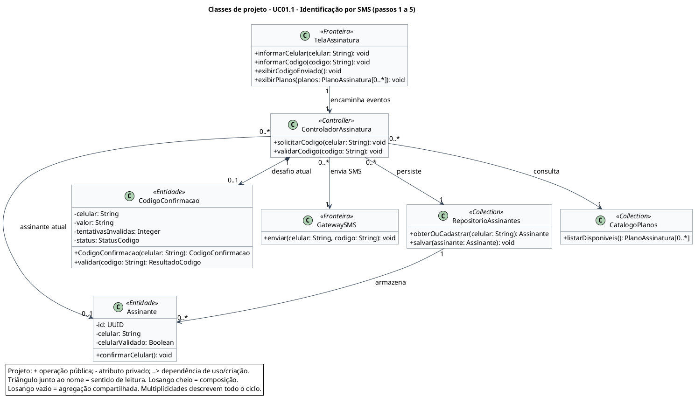
```plantuml
@startuml
!pragma layout smetana
skinparam backgroundColor #FFFFFF
skinparam defaultFontName Arial
skinparam defaultFontSize 14
skinparam shadowing false
skinparam roundcorner 0
skinparam ArrowColor #334155
skinparam sequenceMessageAlign left
skinparam sequenceParticipant underline
skinparam maxMessageSize 260
skinparam ParticipantPadding 18
skinparam BoxPadding 12
skinparam classAttributeIconSize 0
skinparam classBackgroundColor #F8FAFC
skinparam classBorderColor #475569
skinparam sequenceLifeLineBorderColor #94A3B8
skinparam sequenceParticipantBackgroundColor #EFF6FF
skinparam sequenceGroupBackgroundColor #F8FAFC
hide footbox

title Classes de projeto - UC01.1 - Identificação por SMS (passos 1 a 5)
hide empty members
skinparam nodesep 65
skinparam ranksep 90
class Assinante <<Entidade>> {
-id: UUID
-celular: String
-celularValidado: Boolean
+confirmarCelular(): void
}
class CodigoConfirmacao <<Entidade>> {
-celular: String
-valor: String
-tentativasInvalidas: Integer
-status: StatusCodigo
+CodigoConfirmacao(celular: String): CodigoConfirmacao
+validar(codigo: String): ResultadoCodigo
}
class TelaAssinatura <<Fronteira>> {
+informarCelular(celular: String): void
+informarCodigo(codigo: String): void
+exibirCodigoEnviado(): void
+exibirPlanos(planos: PlanoAssinatura[0..*]): void
}
class ControladorAssinatura <<Controller>> {
+solicitarCodigo(celular: String): void
+validarCodigo(codigo: String): void
}
class GatewaySMS <<Fronteira>> {
+enviar(celular: String, codigo: String): void
}
class RepositorioAssinantes <<Collection>> {
+obterOuCadastrar(celular: String): Assinante
+salvar(assinante: Assinante): void
}
class CatalogoPlanos <<Collection>> {
+listarDisponiveis(): PlanoAssinatura[0..*]
}
TelaAssinatura "1" --> "1" ControladorAssinatura : encaminha eventos >
ControladorAssinatura "0..*" --> "0..1" Assinante : assinante atual >
ControladorAssinatura "1" *--> "0..1" CodigoConfirmacao : desafio atual >
ControladorAssinatura "0..*" --> "1" CatalogoPlanos : consulta >
ControladorAssinatura "0..*" --> "1" RepositorioAssinantes : persiste >
ControladorAssinatura "0..*" --> "1" GatewaySMS : envia SMS >
RepositorioAssinantes "1" --> "0..*" Assinante : armazena >
legend bottom left
Projeto: + operação pública; - atributo privado; ..> dependência de uso/criação.
Triângulo junto ao nome = sentido de leitura. Losango cheio = composição.
Losango vazio = agregação compartilhada. Multiplicidades descrevem todo o ciclo.
endlegend
@enduml
```

## classes-02

Abrir fonte

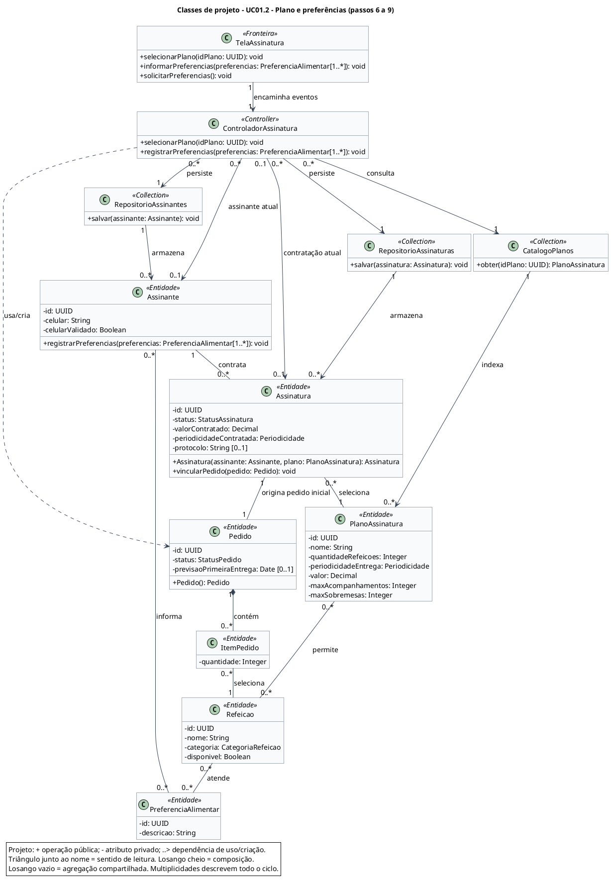
```plantuml
@startuml
!pragma layout smetana
skinparam backgroundColor #FFFFFF
skinparam defaultFontName Arial
skinparam defaultFontSize 14
skinparam shadowing false
skinparam roundcorner 0
skinparam ArrowColor #334155
skinparam sequenceMessageAlign left
skinparam sequenceParticipant underline
skinparam maxMessageSize 260
skinparam ParticipantPadding 18
skinparam BoxPadding 12
skinparam classAttributeIconSize 0
skinparam classBackgroundColor #F8FAFC
skinparam classBorderColor #475569
skinparam sequenceLifeLineBorderColor #94A3B8
skinparam sequenceParticipantBackgroundColor #EFF6FF
skinparam sequenceGroupBackgroundColor #F8FAFC
hide footbox

title Classes de projeto - UC01.2 - Plano e preferências (passos 6 a 9)
hide empty members
skinparam nodesep 65
skinparam ranksep 90
class Assinante <<Entidade>> {
-id: UUID
-celular: String
-celularValidado: Boolean
+registrarPreferencias(preferencias: PreferenciaAlimentar[1..*]): void
}
class PlanoAssinatura <<Entidade>> {
-id: UUID
-nome: String
-quantidadeRefeicoes: Integer
-periodicidadeEntrega: Periodicidade
-valor: Decimal
-maxAcompanhamentos: Integer
-maxSobremesas: Integer
}
class Assinatura <<Entidade>> {
-id: UUID
-status: StatusAssinatura
-valorContratado: Decimal
-periodicidadeContratada: Periodicidade
-protocolo: String [0..1]
+Assinatura(assinante: Assinante, plano: PlanoAssinatura): Assinatura
+vincularPedido(pedido: Pedido): void
}
class PreferenciaAlimentar <<Entidade>> {
-id: UUID
-descricao: String
}
class Refeicao <<Entidade>> {
-id: UUID
-nome: String
-categoria: CategoriaRefeicao
-disponivel: Boolean
}
class Pedido <<Entidade>> {
-id: UUID
-status: StatusPedido
-previsaoPrimeiraEntrega: Date [0..1]
+Pedido(): Pedido
}
class ItemPedido <<Entidade>> {
-quantidade: Integer
}
class TelaAssinatura <<Fronteira>> {
+selecionarPlano(idPlano: UUID): void
+informarPreferencias(preferencias: PreferenciaAlimentar[1..*]): void
+solicitarPreferencias(): void
}
class ControladorAssinatura <<Controller>> {
+selecionarPlano(idPlano: UUID): void
+registrarPreferencias(preferencias: PreferenciaAlimentar[1..*]): void
}
class RepositorioAssinantes <<Collection>> {
+salvar(assinante: Assinante): void
}
class CatalogoPlanos <<Collection>> {
+obter(idPlano: UUID): PlanoAssinatura
}
class RepositorioAssinaturas <<Collection>> {
+salvar(assinatura: Assinatura): void
}
Assinante "1" -- "0..*" Assinatura : contrata >
Assinatura "0..*" -- "1" PlanoAssinatura : seleciona >
Assinante "0..*" -- "0..*" PreferenciaAlimentar : informa >
Assinatura "1" -- "1" Pedido : origina pedido inicial >
Pedido "1" *-- "0..*" ItemPedido : contém >
ItemPedido "0..*" -- "1" Refeicao : seleciona >
PlanoAssinatura "0..*" -- "0..*" Refeicao : permite >
Refeicao "0..*" -- "0..*" PreferenciaAlimentar : atende >
TelaAssinatura "1" --> "1" ControladorAssinatura : encaminha eventos >
ControladorAssinatura "0..*" --> "0..1" Assinante : assinante atual >
ControladorAssinatura "0..1" --> "0..1" Assinatura : contratação atual >
ControladorAssinatura "0..*" --> "1" CatalogoPlanos : consulta >
ControladorAssinatura "0..*" --> "1" RepositorioAssinantes : persiste >
ControladorAssinatura "0..*" --> "1" RepositorioAssinaturas : persiste >
CatalogoPlanos "1" --> "0..*" PlanoAssinatura : indexa >
RepositorioAssinantes "1" --> "0..*" Assinante : armazena >
RepositorioAssinaturas "1" --> "0..*" Assinatura : armazena >
ControladorAssinatura ..> Pedido : usa/cria
legend bottom left
Projeto: + operação pública; - atributo privado; ..> dependência de uso/criação.
Triângulo junto ao nome = sentido de leitura. Losango cheio = composição.
Losango vazio = agregação compartilhada. Multiplicidades descrevem todo o ciclo.
endlegend
@enduml
```

## classes-03

Abrir fonte

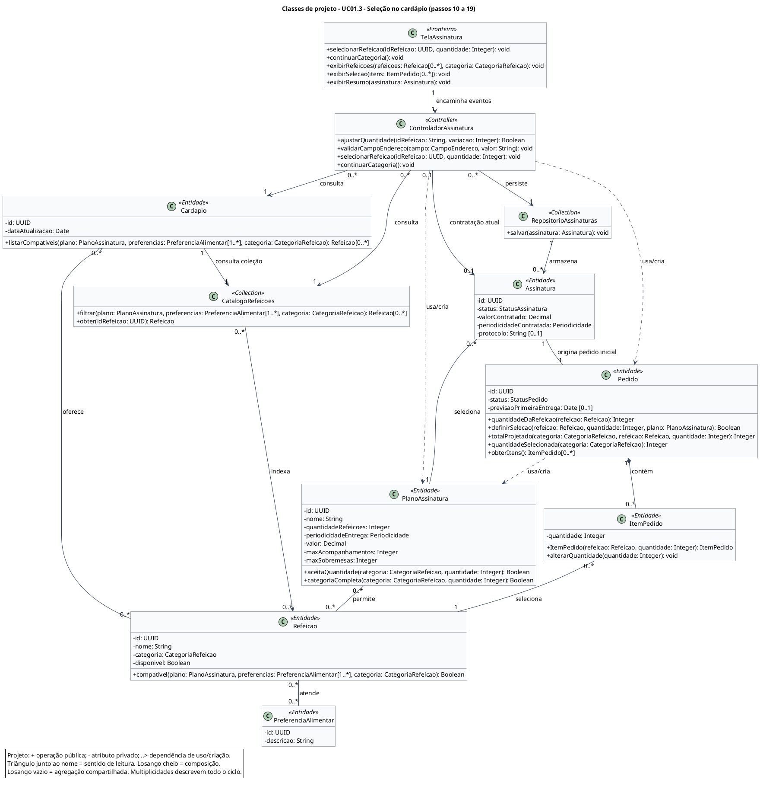
```plantuml
@startuml
!pragma layout smetana
skinparam backgroundColor #FFFFFF
skinparam defaultFontName Arial
skinparam defaultFontSize 14
skinparam shadowing false
skinparam roundcorner 0
skinparam ArrowColor #334155
skinparam sequenceMessageAlign left
skinparam sequenceParticipant underline
skinparam maxMessageSize 260
skinparam ParticipantPadding 18
skinparam BoxPadding 12
skinparam classAttributeIconSize 0
skinparam classBackgroundColor #F8FAFC
skinparam classBorderColor #475569
skinparam sequenceLifeLineBorderColor #94A3B8
skinparam sequenceParticipantBackgroundColor #EFF6FF
skinparam sequenceGroupBackgroundColor #F8FAFC
hide footbox

title Classes de projeto - UC01.3 - Seleção no cardápio (passos 10 a 19)
hide empty members
skinparam nodesep 65
skinparam ranksep 90
class PlanoAssinatura <<Entidade>> {
-id: UUID
-nome: String
-quantidadeRefeicoes: Integer
-periodicidadeEntrega: Periodicidade
-valor: Decimal
-maxAcompanhamentos: Integer
-maxSobremesas: Integer
+aceitaQuantidade(categoria: CategoriaRefeicao, quantidade: Integer): Boolean
+categoriaCompleta(categoria: CategoriaRefeicao, quantidade: Integer): Boolean
}
class Assinatura <<Entidade>> {
-id: UUID
-status: StatusAssinatura
-valorContratado: Decimal
-periodicidadeContratada: Periodicidade
-protocolo: String [0..1]
}
class PreferenciaAlimentar <<Entidade>> {
-id: UUID
-descricao: String
}
class Cardapio <<Entidade>> {
-id: UUID
-dataAtualizacao: Date
+listarCompativeis(plano: PlanoAssinatura, preferencias: PreferenciaAlimentar[1..*], categoria: CategoriaRefeicao): Refeicao[0..*]
}
class Refeicao <<Entidade>> {
-id: UUID
-nome: String
-categoria: CategoriaRefeicao
-disponivel: Boolean
+compativel(plano: PlanoAssinatura, preferencias: PreferenciaAlimentar[1..*], categoria: CategoriaRefeicao): Boolean
}
class Pedido <<Entidade>> {
+quantidadeDaRefeicao(refeicao: Refeicao): Integer
-id: UUID
-status: StatusPedido
-previsaoPrimeiraEntrega: Date [0..1]
+definirSelecao(refeicao: Refeicao, quantidade: Integer, plano: PlanoAssinatura): Boolean
+totalProjetado(categoria: CategoriaRefeicao, refeicao: Refeicao, quantidade: Integer): Integer
+quantidadeSelecionada(categoria: CategoriaRefeicao): Integer
+obterItens(): ItemPedido[0..*]
}
class ItemPedido <<Entidade>> {
-quantidade: Integer
+ItemPedido(refeicao: Refeicao, quantidade: Integer): ItemPedido
+alterarQuantidade(quantidade: Integer): void
}
class TelaAssinatura <<Fronteira>> {
+selecionarRefeicao(idRefeicao: UUID, quantidade: Integer): void
+continuarCategoria(): void
+exibirRefeicoes(refeicoes: Refeicao[0..*], categoria: CategoriaRefeicao): void
+exibirSelecao(itens: ItemPedido[0..*]): void
+exibirResumo(assinatura: Assinatura): void
}
class ControladorAssinatura <<Controller>> {
+ajustarQuantidade(idRefeicao: String, variacao: Integer): Boolean
+validarCampoEndereco(campo: CampoEndereco, valor: String): void
+selecionarRefeicao(idRefeicao: UUID, quantidade: Integer): void
+continuarCategoria(): void
}
class CatalogoRefeicoes <<Collection>> {
+filtrar(plano: PlanoAssinatura, preferencias: PreferenciaAlimentar[1..*], categoria: CategoriaRefeicao): Refeicao[0..*]
+obter(idRefeicao: UUID): Refeicao
}
class RepositorioAssinaturas <<Collection>> {
+salvar(assinatura: Assinatura): void
}
Assinatura "0..*" -- "1" PlanoAssinatura : seleciona >
Assinatura "1" -- "1" Pedido : origina pedido inicial >
Pedido "1" *-- "0..*" ItemPedido : contém >
ItemPedido "0..*" -- "1" Refeicao : seleciona >
Cardapio "0..*" o-- "0..*" Refeicao : oferece >
PlanoAssinatura "0..*" -- "0..*" Refeicao : permite >
Refeicao "0..*" -- "0..*" PreferenciaAlimentar : atende >
TelaAssinatura "1" --> "1" ControladorAssinatura : encaminha eventos >
ControladorAssinatura "0..1" --> "0..1" Assinatura : contratação atual >
ControladorAssinatura "0..*" --> "1" Cardapio : consulta >
ControladorAssinatura "0..*" --> "1" CatalogoRefeicoes : consulta >
ControladorAssinatura "0..*" --> "1" RepositorioAssinaturas : persiste >
Cardapio "1" --> "1" CatalogoRefeicoes : consulta coleção >
CatalogoRefeicoes "0..*" --> "0..*" Refeicao : indexa >
RepositorioAssinaturas "1" --> "0..*" Assinatura : armazena >
ControladorAssinatura ..> Pedido : usa/cria
ControladorAssinatura ..> PlanoAssinatura : usa/cria
Pedido ..> PlanoAssinatura : usa/cria
legend bottom left
Projeto: + operação pública; - atributo privado; ..> dependência de uso/criação.
Triângulo junto ao nome = sentido de leitura. Losango cheio = composição.
Losango vazio = agregação compartilhada. Multiplicidades descrevem todo o ciclo.
endlegend
@enduml
```

## classes-04

Abrir fonte

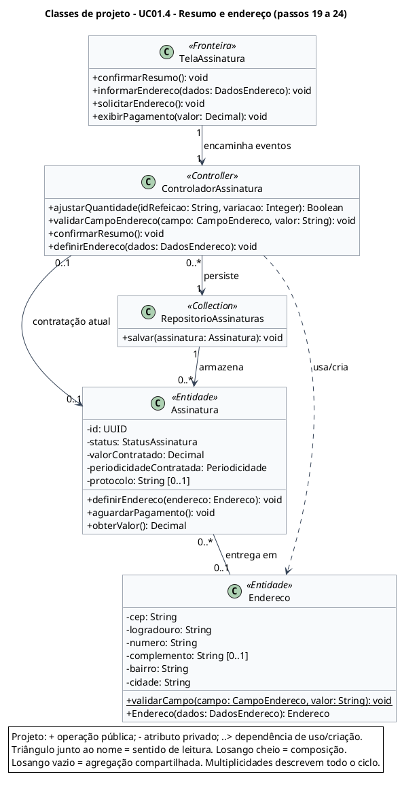
```plantuml
@startuml
!pragma layout smetana
skinparam backgroundColor #FFFFFF
skinparam defaultFontName Arial
skinparam defaultFontSize 14
skinparam shadowing false
skinparam roundcorner 0
skinparam ArrowColor #334155
skinparam sequenceMessageAlign left
skinparam sequenceParticipant underline
skinparam maxMessageSize 260
skinparam ParticipantPadding 18
skinparam BoxPadding 12
skinparam classAttributeIconSize 0
skinparam classBackgroundColor #F8FAFC
skinparam classBorderColor #475569
skinparam sequenceLifeLineBorderColor #94A3B8
skinparam sequenceParticipantBackgroundColor #EFF6FF
skinparam sequenceGroupBackgroundColor #F8FAFC
hide footbox

title Classes de projeto - UC01.4 - Resumo e endereço (passos 19 a 24)
hide empty members
skinparam nodesep 65
skinparam ranksep 90
class Assinatura <<Entidade>> {
-id: UUID
-status: StatusAssinatura
-valorContratado: Decimal
-periodicidadeContratada: Periodicidade
-protocolo: String [0..1]
+definirEndereco(endereco: Endereco): void
+aguardarPagamento(): void
+obterValor(): Decimal
}
class Endereco <<Entidade>> {
+{static} validarCampo(campo: CampoEndereco, valor: String): void
-cep: String
-logradouro: String
-numero: String
-complemento: String [0..1]
-bairro: String
-cidade: String
+Endereco(dados: DadosEndereco): Endereco
}
class TelaAssinatura <<Fronteira>> {
+confirmarResumo(): void
+informarEndereco(dados: DadosEndereco): void
+solicitarEndereco(): void
+exibirPagamento(valor: Decimal): void
}
class ControladorAssinatura <<Controller>> {
+ajustarQuantidade(idRefeicao: String, variacao: Integer): Boolean
+validarCampoEndereco(campo: CampoEndereco, valor: String): void
+confirmarResumo(): void
+definirEndereco(dados: DadosEndereco): void
}
class RepositorioAssinaturas <<Collection>> {
+salvar(assinatura: Assinatura): void
}
Assinatura "0..*" -- "0..1" Endereco : entrega em >
TelaAssinatura "1" --> "1" ControladorAssinatura : encaminha eventos >
ControladorAssinatura "0..1" --> "0..1" Assinatura : contratação atual >
ControladorAssinatura "0..*" --> "1" RepositorioAssinaturas : persiste >
RepositorioAssinaturas "1" --> "0..*" Assinatura : armazena >
ControladorAssinatura ..> Endereco : usa/cria
legend bottom left
Projeto: + operação pública; - atributo privado; ..> dependência de uso/criação.
Triângulo junto ao nome = sentido de leitura. Losango cheio = composição.
Losango vazio = agregação compartilhada. Multiplicidades descrevem todo o ciclo.
endlegend
@enduml
```

## classes-05

Abrir fonte

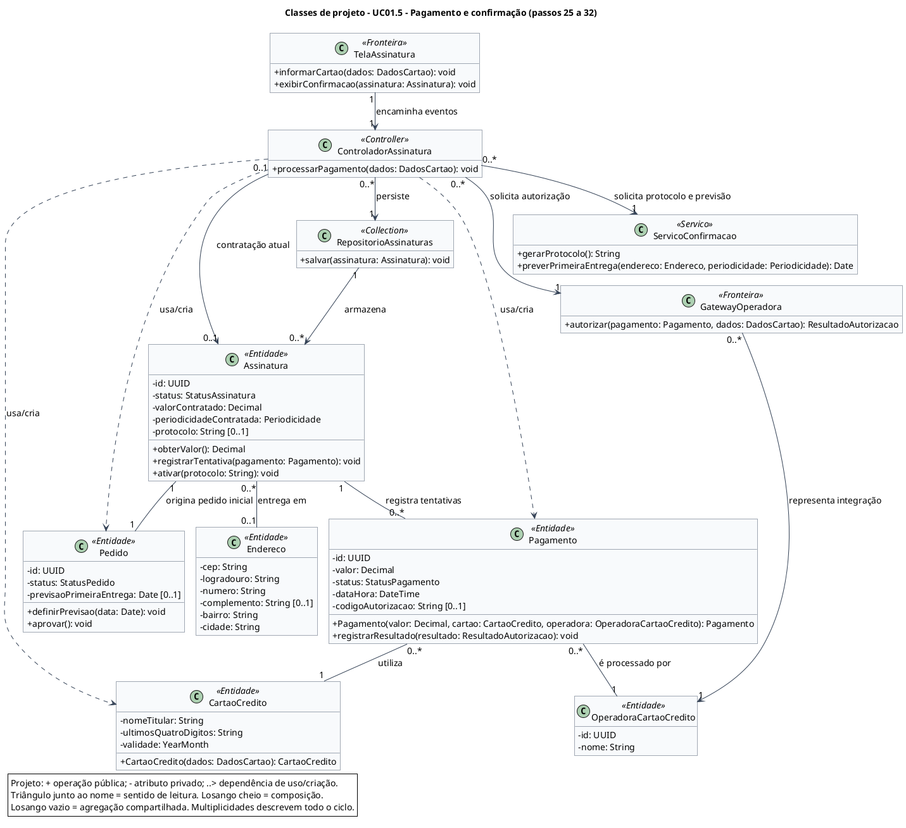
```plantuml
@startuml
!pragma layout smetana
skinparam backgroundColor #FFFFFF
skinparam defaultFontName Arial
skinparam defaultFontSize 14
skinparam shadowing false
skinparam roundcorner 0
skinparam ArrowColor #334155
skinparam sequenceMessageAlign left
skinparam sequenceParticipant underline
skinparam maxMessageSize 260
skinparam ParticipantPadding 18
skinparam BoxPadding 12
skinparam classAttributeIconSize 0
skinparam classBackgroundColor #F8FAFC
skinparam classBorderColor #475569
skinparam sequenceLifeLineBorderColor #94A3B8
skinparam sequenceParticipantBackgroundColor #EFF6FF
skinparam sequenceGroupBackgroundColor #F8FAFC
hide footbox

title Classes de projeto - UC01.5 - Pagamento e confirmação (passos 25 a 32)
hide empty members
skinparam nodesep 65
skinparam ranksep 90
class Assinatura <<Entidade>> {
-id: UUID
-status: StatusAssinatura
-valorContratado: Decimal
-periodicidadeContratada: Periodicidade
-protocolo: String [0..1]
+obterValor(): Decimal
+registrarTentativa(pagamento: Pagamento): void
+ativar(protocolo: String): void
}
class Pedido <<Entidade>> {
-id: UUID
-status: StatusPedido
-previsaoPrimeiraEntrega: Date [0..1]
+definirPrevisao(data: Date): void
+aprovar(): void
}
class Endereco <<Entidade>> {
-cep: String
-logradouro: String
-numero: String
-complemento: String [0..1]
-bairro: String
-cidade: String
}
class Pagamento <<Entidade>> {
-id: UUID
-valor: Decimal
-status: StatusPagamento
-dataHora: DateTime
-codigoAutorizacao: String [0..1]
+Pagamento(valor: Decimal, cartao: CartaoCredito, operadora: OperadoraCartaoCredito): Pagamento
+registrarResultado(resultado: ResultadoAutorizacao): void
}
class CartaoCredito <<Entidade>> {
-nomeTitular: String
-ultimosQuatroDigitos: String
-validade: YearMonth
+CartaoCredito(dados: DadosCartao): CartaoCredito
}
class OperadoraCartaoCredito <<Entidade>> {
-id: UUID
-nome: String
}
class TelaAssinatura <<Fronteira>> {
+informarCartao(dados: DadosCartao): void
+exibirConfirmacao(assinatura: Assinatura): void
}
class ControladorAssinatura <<Controller>> {
+processarPagamento(dados: DadosCartao): void
}
class GatewayOperadora <<Fronteira>> {
+autorizar(pagamento: Pagamento, dados: DadosCartao): ResultadoAutorizacao
}
class RepositorioAssinaturas <<Collection>> {
+salvar(assinatura: Assinatura): void
}
class ServicoConfirmacao <<Servico>> {
+gerarProtocolo(): String
+preverPrimeiraEntrega(endereco: Endereco, periodicidade: Periodicidade): Date
}
Assinatura "1" -- "1" Pedido : origina pedido inicial >
Assinatura "0..*" -- "0..1" Endereco : entrega em >
Assinatura "1" -- "0..*" Pagamento : registra tentativas >
Pagamento "0..*" -- "1" CartaoCredito : utiliza >
Pagamento "0..*" -- "1" OperadoraCartaoCredito : é processado por >
TelaAssinatura "1" --> "1" ControladorAssinatura : encaminha eventos >
ControladorAssinatura "0..1" --> "0..1" Assinatura : contratação atual >
ControladorAssinatura "0..*" --> "1" RepositorioAssinaturas : persiste >
ControladorAssinatura "0..*" --> "1" GatewayOperadora : solicita autorização >
ControladorAssinatura "0..*" --> "1" ServicoConfirmacao : solicita protocolo e previsão >
RepositorioAssinaturas "1" --> "0..*" Assinatura : armazena >
GatewayOperadora "0..*" --> "1" OperadoraCartaoCredito : representa integração >
ControladorAssinatura ..> CartaoCredito : usa/cria
ControladorAssinatura ..> Pagamento : usa/cria
ControladorAssinatura ..> Pedido : usa/cria
legend bottom left
Projeto: + operação pública; - atributo privado; ..> dependência de uso/criação.
Triângulo junto ao nome = sentido de leitura. Losango cheio = composição.
Losango vazio = agregação compartilhada. Multiplicidades descrevem todo o ciclo.
endlegend
@enduml
```

## classes-06

Abrir fonte

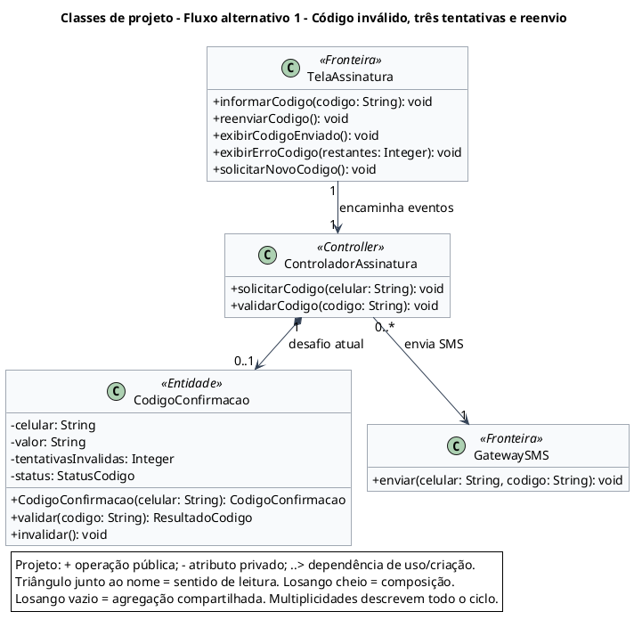
```plantuml
@startuml
!pragma layout smetana
skinparam backgroundColor #FFFFFF
skinparam defaultFontName Arial
skinparam defaultFontSize 14
skinparam shadowing false
skinparam roundcorner 0
skinparam ArrowColor #334155
skinparam sequenceMessageAlign left
skinparam sequenceParticipant underline
skinparam maxMessageSize 260
skinparam ParticipantPadding 18
skinparam BoxPadding 12
skinparam classAttributeIconSize 0
skinparam classBackgroundColor #F8FAFC
skinparam classBorderColor #475569
skinparam sequenceLifeLineBorderColor #94A3B8
skinparam sequenceParticipantBackgroundColor #EFF6FF
skinparam sequenceGroupBackgroundColor #F8FAFC
hide footbox

title Classes de projeto - Fluxo alternativo 1 - Código inválido, três tentativas e reenvio
hide empty members
skinparam nodesep 65
skinparam ranksep 90
class CodigoConfirmacao <<Entidade>> {
-celular: String
-valor: String
-tentativasInvalidas: Integer
-status: StatusCodigo
+CodigoConfirmacao(celular: String): CodigoConfirmacao
+validar(codigo: String): ResultadoCodigo
+invalidar(): void
}
class TelaAssinatura <<Fronteira>> {
+informarCodigo(codigo: String): void
+reenviarCodigo(): void
+exibirCodigoEnviado(): void
+exibirErroCodigo(restantes: Integer): void
+solicitarNovoCodigo(): void
}
class ControladorAssinatura <<Controller>> {
+solicitarCodigo(celular: String): void
+validarCodigo(codigo: String): void
}
class GatewaySMS <<Fronteira>> {
+enviar(celular: String, codigo: String): void
}
TelaAssinatura "1" --> "1" ControladorAssinatura : encaminha eventos >
ControladorAssinatura "1" *--> "0..1" CodigoConfirmacao : desafio atual >
ControladorAssinatura "0..*" --> "1" GatewaySMS : envia SMS >
legend bottom left
Projeto: + operação pública; - atributo privado; ..> dependência de uso/criação.
Triângulo junto ao nome = sentido de leitura. Losango cheio = composição.
Losango vazio = agregação compartilhada. Multiplicidades descrevem todo o ciclo.
endlegend
@enduml
```

## classes-07

Abrir fonte

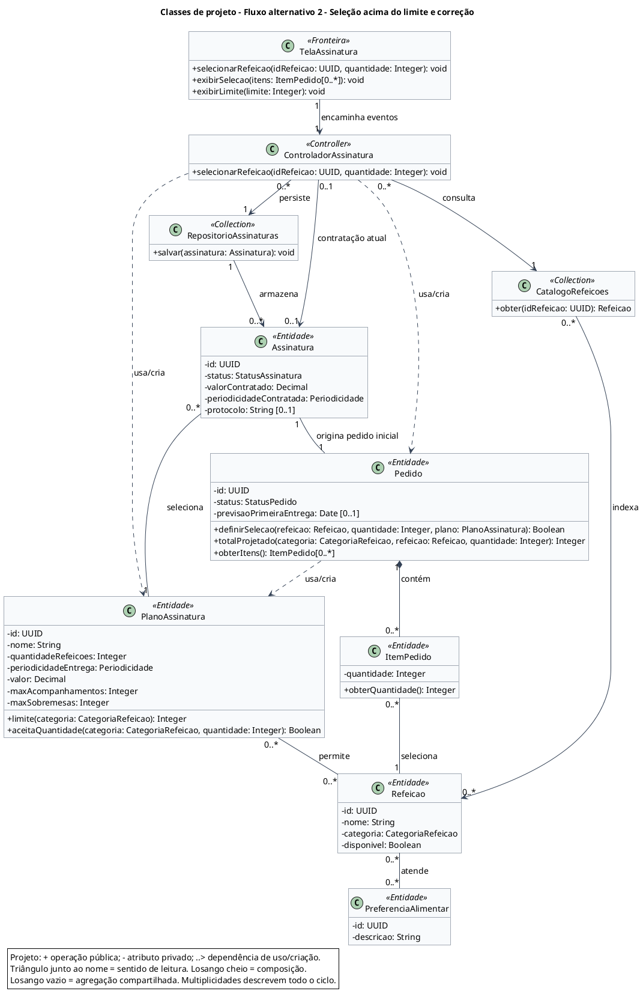
```plantuml
@startuml
!pragma layout smetana
skinparam backgroundColor #FFFFFF
skinparam defaultFontName Arial
skinparam defaultFontSize 14
skinparam shadowing false
skinparam roundcorner 0
skinparam ArrowColor #334155
skinparam sequenceMessageAlign left
skinparam sequenceParticipant underline
skinparam maxMessageSize 260
skinparam ParticipantPadding 18
skinparam BoxPadding 12
skinparam classAttributeIconSize 0
skinparam classBackgroundColor #F8FAFC
skinparam classBorderColor #475569
skinparam sequenceLifeLineBorderColor #94A3B8
skinparam sequenceParticipantBackgroundColor #EFF6FF
skinparam sequenceGroupBackgroundColor #F8FAFC
hide footbox

title Classes de projeto - Fluxo alternativo 2 - Seleção acima do limite e correção
hide empty members
skinparam nodesep 65
skinparam ranksep 90
class PlanoAssinatura <<Entidade>> {
-id: UUID
-nome: String
-quantidadeRefeicoes: Integer
-periodicidadeEntrega: Periodicidade
-valor: Decimal
-maxAcompanhamentos: Integer
-maxSobremesas: Integer
+limite(categoria: CategoriaRefeicao): Integer
+aceitaQuantidade(categoria: CategoriaRefeicao, quantidade: Integer): Boolean
}
class Assinatura <<Entidade>> {
-id: UUID
-status: StatusAssinatura
-valorContratado: Decimal
-periodicidadeContratada: Periodicidade
-protocolo: String [0..1]
}
class PreferenciaAlimentar <<Entidade>> {
-id: UUID
-descricao: String
}
class Refeicao <<Entidade>> {
-id: UUID
-nome: String
-categoria: CategoriaRefeicao
-disponivel: Boolean
}
class Pedido <<Entidade>> {
-id: UUID
-status: StatusPedido
-previsaoPrimeiraEntrega: Date [0..1]
+definirSelecao(refeicao: Refeicao, quantidade: Integer, plano: PlanoAssinatura): Boolean
+totalProjetado(categoria: CategoriaRefeicao, refeicao: Refeicao, quantidade: Integer): Integer
+obterItens(): ItemPedido[0..*]
}
class ItemPedido <<Entidade>> {
-quantidade: Integer
+obterQuantidade(): Integer
}
class TelaAssinatura <<Fronteira>> {
+selecionarRefeicao(idRefeicao: UUID, quantidade: Integer): void
+exibirSelecao(itens: ItemPedido[0..*]): void
+exibirLimite(limite: Integer): void
}
class ControladorAssinatura <<Controller>> {
+selecionarRefeicao(idRefeicao: UUID, quantidade: Integer): void
}
class CatalogoRefeicoes <<Collection>> {
+obter(idRefeicao: UUID): Refeicao
}
class RepositorioAssinaturas <<Collection>> {
+salvar(assinatura: Assinatura): void
}
Assinatura "0..*" -- "1" PlanoAssinatura : seleciona >
Assinatura "1" -- "1" Pedido : origina pedido inicial >
Pedido "1" *-- "0..*" ItemPedido : contém >
ItemPedido "0..*" -- "1" Refeicao : seleciona >
PlanoAssinatura "0..*" -- "0..*" Refeicao : permite >
Refeicao "0..*" -- "0..*" PreferenciaAlimentar : atende >
TelaAssinatura "1" --> "1" ControladorAssinatura : encaminha eventos >
ControladorAssinatura "0..1" --> "0..1" Assinatura : contratação atual >
ControladorAssinatura "0..*" --> "1" CatalogoRefeicoes : consulta >
ControladorAssinatura "0..*" --> "1" RepositorioAssinaturas : persiste >
CatalogoRefeicoes "0..*" --> "0..*" Refeicao : indexa >
RepositorioAssinaturas "1" --> "0..*" Assinatura : armazena >
ControladorAssinatura ..> Pedido : usa/cria
ControladorAssinatura ..> PlanoAssinatura : usa/cria
Pedido ..> PlanoAssinatura : usa/cria
legend bottom left
Projeto: + operação pública; - atributo privado; ..> dependência de uso/criação.
Triângulo junto ao nome = sentido de leitura. Losango cheio = composição.
Losango vazio = agregação compartilhada. Multiplicidades descrevem todo o ciclo.
endlegend
@enduml
```

## classes-08

Abrir fonte

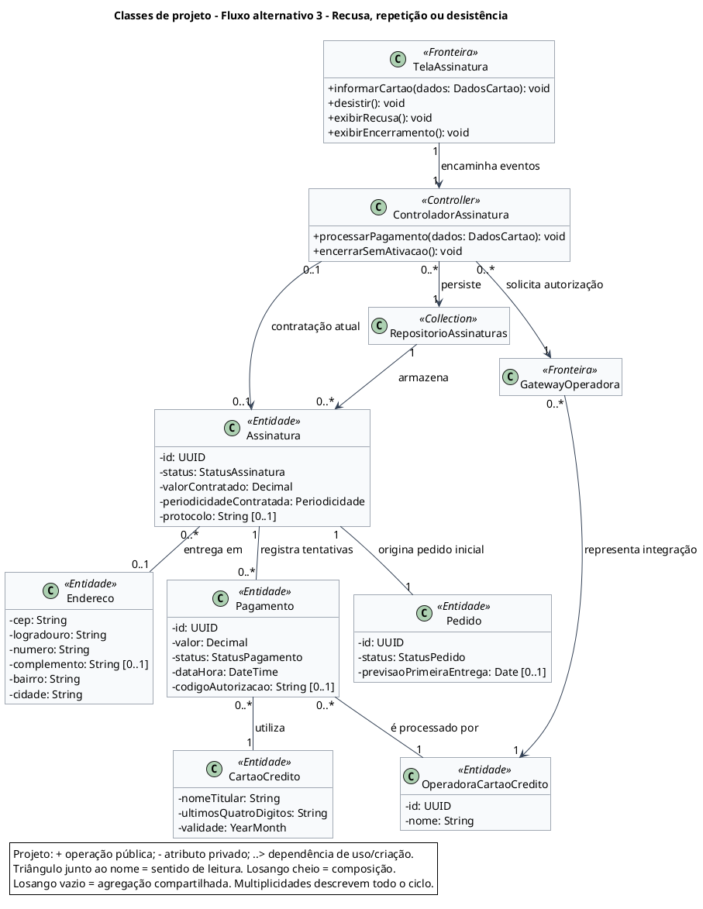
```plantuml
@startuml
!pragma layout smetana
skinparam backgroundColor #FFFFFF
skinparam defaultFontName Arial
skinparam defaultFontSize 14
skinparam shadowing false
skinparam roundcorner 0
skinparam ArrowColor #334155
skinparam sequenceMessageAlign left
skinparam sequenceParticipant underline
skinparam maxMessageSize 260
skinparam ParticipantPadding 18
skinparam BoxPadding 12
skinparam classAttributeIconSize 0
skinparam classBackgroundColor #F8FAFC
skinparam classBorderColor #475569
skinparam sequenceLifeLineBorderColor #94A3B8
skinparam sequenceParticipantBackgroundColor #EFF6FF
skinparam sequenceGroupBackgroundColor #F8FAFC
hide footbox

title Classes de projeto - Fluxo alternativo 3 - Recusa, repetição ou desistência
hide empty members
skinparam nodesep 65
skinparam ranksep 90
class Assinatura <<Entidade>> {
-id: UUID
-status: StatusAssinatura
-valorContratado: Decimal
-periodicidadeContratada: Periodicidade
-protocolo: String [0..1]
}
class Pedido <<Entidade>> {
-id: UUID
-status: StatusPedido
-previsaoPrimeiraEntrega: Date [0..1]
}
class Endereco <<Entidade>> {
-cep: String
-logradouro: String
-numero: String
-complemento: String [0..1]
-bairro: String
-cidade: String
}
class Pagamento <<Entidade>> {
-id: UUID
-valor: Decimal
-status: StatusPagamento
-dataHora: DateTime
-codigoAutorizacao: String [0..1]
}
class CartaoCredito <<Entidade>> {
-nomeTitular: String
-ultimosQuatroDigitos: String
-validade: YearMonth
}
class OperadoraCartaoCredito <<Entidade>> {
-id: UUID
-nome: String
}
class TelaAssinatura <<Fronteira>> {
+informarCartao(dados: DadosCartao): void
+desistir(): void
+exibirRecusa(): void
+exibirEncerramento(): void
}
class ControladorAssinatura <<Controller>> {
+processarPagamento(dados: DadosCartao): void
+encerrarSemAtivacao(): void
}
class GatewayOperadora <<Fronteira>> {
}
class RepositorioAssinaturas <<Collection>> {
}
Assinatura "1" -- "1" Pedido : origina pedido inicial >
Assinatura "0..*" -- "0..1" Endereco : entrega em >
Assinatura "1" -- "0..*" Pagamento : registra tentativas >
Pagamento "0..*" -- "1" CartaoCredito : utiliza >
Pagamento "0..*" -- "1" OperadoraCartaoCredito : é processado por >
TelaAssinatura "1" --> "1" ControladorAssinatura : encaminha eventos >
ControladorAssinatura "0..1" --> "0..1" Assinatura : contratação atual >
ControladorAssinatura "0..*" --> "1" RepositorioAssinaturas : persiste >
ControladorAssinatura "0..*" --> "1" GatewayOperadora : solicita autorização >
RepositorioAssinaturas "1" --> "0..*" Assinatura : armazena >
GatewayOperadora "0..*" --> "1" OperadoraCartaoCredito : representa integração >
legend bottom left
Projeto: + operação pública; - atributo privado; ..> dependência de uso/criação.
Triângulo junto ao nome = sentido de leitura. Losango cheio = composição.
Losango vazio = agregação compartilhada. Multiplicidades descrevem todo o ciclo.
endlegend
@enduml
```

## classes-consolidado

Abrir fonte

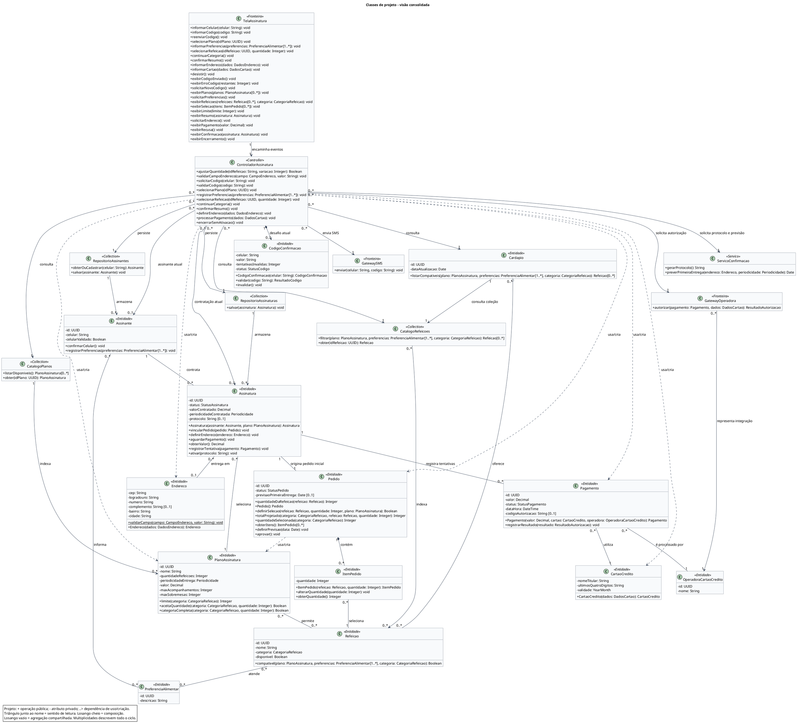
```plantuml
@startuml
!pragma layout smetana
skinparam backgroundColor #FFFFFF
skinparam defaultFontName Arial
skinparam defaultFontSize 14
skinparam shadowing false
skinparam roundcorner 0
skinparam ArrowColor #334155
skinparam sequenceMessageAlign left
skinparam sequenceParticipant underline
skinparam maxMessageSize 260
skinparam ParticipantPadding 18
skinparam BoxPadding 12
skinparam classAttributeIconSize 0
skinparam classBackgroundColor #F8FAFC
skinparam classBorderColor #475569
skinparam sequenceLifeLineBorderColor #94A3B8
skinparam sequenceParticipantBackgroundColor #EFF6FF
skinparam sequenceGroupBackgroundColor #F8FAFC
hide footbox

title Classes de projeto - visão consolidada
hide empty members
skinparam nodesep 65
skinparam ranksep 90
class Assinante <<Entidade>> {
-id: UUID
-celular: String
-celularValidado: Boolean
+confirmarCelular(): void
+registrarPreferencias(preferencias: PreferenciaAlimentar[1..*]): void
}
class PlanoAssinatura <<Entidade>> {
-id: UUID
-nome: String
-quantidadeRefeicoes: Integer
-periodicidadeEntrega: Periodicidade
-valor: Decimal
-maxAcompanhamentos: Integer
-maxSobremesas: Integer
+limite(categoria: CategoriaRefeicao): Integer
+aceitaQuantidade(categoria: CategoriaRefeicao, quantidade: Integer): Boolean
+categoriaCompleta(categoria: CategoriaRefeicao, quantidade: Integer): Boolean
}
class Assinatura <<Entidade>> {
-id: UUID
-status: StatusAssinatura
-valorContratado: Decimal
-periodicidadeContratada: Periodicidade
-protocolo: String [0..1]
+Assinatura(assinante: Assinante, plano: PlanoAssinatura): Assinatura
+vincularPedido(pedido: Pedido): void
+definirEndereco(endereco: Endereco): void
+aguardarPagamento(): void
+obterValor(): Decimal
+registrarTentativa(pagamento: Pagamento): void
+ativar(protocolo: String): void
}
class PreferenciaAlimentar <<Entidade>> {
-id: UUID
-descricao: String
}
class Cardapio <<Entidade>> {
-id: UUID
-dataAtualizacao: Date
+listarCompativeis(plano: PlanoAssinatura, preferencias: PreferenciaAlimentar[1..*], categoria: CategoriaRefeicao): Refeicao[0..*]
}
class Refeicao <<Entidade>> {
-id: UUID
-nome: String
-categoria: CategoriaRefeicao
-disponivel: Boolean
+compativel(plano: PlanoAssinatura, preferencias: PreferenciaAlimentar[1..*], categoria: CategoriaRefeicao): Boolean
}
class Pedido <<Entidade>> {
+quantidadeDaRefeicao(refeicao: Refeicao): Integer
-id: UUID
-status: StatusPedido
-previsaoPrimeiraEntrega: Date [0..1]
+Pedido(): Pedido
+definirSelecao(refeicao: Refeicao, quantidade: Integer, plano: PlanoAssinatura): Boolean
+totalProjetado(categoria: CategoriaRefeicao, refeicao: Refeicao, quantidade: Integer): Integer
+quantidadeSelecionada(categoria: CategoriaRefeicao): Integer
+obterItens(): ItemPedido[0..*]
+definirPrevisao(data: Date): void
+aprovar(): void
}
class ItemPedido <<Entidade>> {
-quantidade: Integer
+ItemPedido(refeicao: Refeicao, quantidade: Integer): ItemPedido
+alterarQuantidade(quantidade: Integer): void
+obterQuantidade(): Integer
}
class Endereco <<Entidade>> {
+{static} validarCampo(campo: CampoEndereco, valor: String): void
-cep: String
-logradouro: String
-numero: String
-complemento: String [0..1]
-bairro: String
-cidade: String
+Endereco(dados: DadosEndereco): Endereco
}
class Pagamento <<Entidade>> {
-id: UUID
-valor: Decimal
-status: StatusPagamento
-dataHora: DateTime
-codigoAutorizacao: String [0..1]
+Pagamento(valor: Decimal, cartao: CartaoCredito, operadora: OperadoraCartaoCredito): Pagamento
+registrarResultado(resultado: ResultadoAutorizacao): void
}
class CartaoCredito <<Entidade>> {
-nomeTitular: String
-ultimosQuatroDigitos: String
-validade: YearMonth
+CartaoCredito(dados: DadosCartao): CartaoCredito
}
class OperadoraCartaoCredito <<Entidade>> {
-id: UUID
-nome: String
}
class CodigoConfirmacao <<Entidade>> {
-celular: String
-valor: String
-tentativasInvalidas: Integer
-status: StatusCodigo
+CodigoConfirmacao(celular: String): CodigoConfirmacao
+validar(codigo: String): ResultadoCodigo
+invalidar(): void
}
class TelaAssinatura <<Fronteira>> {
+informarCelular(celular: String): void
+informarCodigo(codigo: String): void
+reenviarCodigo(): void
+selecionarPlano(idPlano: UUID): void
+informarPreferencias(preferencias: PreferenciaAlimentar[1..*]): void
+selecionarRefeicao(idRefeicao: UUID, quantidade: Integer): void
+continuarCategoria(): void
+confirmarResumo(): void
+informarEndereco(dados: DadosEndereco): void
+informarCartao(dados: DadosCartao): void
+desistir(): void
+exibirCodigoEnviado(): void
+exibirErroCodigo(restantes: Integer): void
+solicitarNovoCodigo(): void
+exibirPlanos(planos: PlanoAssinatura[0..*]): void
+solicitarPreferencias(): void
+exibirRefeicoes(refeicoes: Refeicao[0..*], categoria: CategoriaRefeicao): void
+exibirSelecao(itens: ItemPedido[0..*]): void
+exibirLimite(limite: Integer): void
+exibirResumo(assinatura: Assinatura): void
+solicitarEndereco(): void
+exibirPagamento(valor: Decimal): void
+exibirRecusa(): void
+exibirConfirmacao(assinatura: Assinatura): void
+exibirEncerramento(): void
}
class ControladorAssinatura <<Controller>> {
+ajustarQuantidade(idRefeicao: String, variacao: Integer): Boolean
+validarCampoEndereco(campo: CampoEndereco, valor: String): void
+solicitarCodigo(celular: String): void
+validarCodigo(codigo: String): void
+selecionarPlano(idPlano: UUID): void
+registrarPreferencias(preferencias: PreferenciaAlimentar[1..*]): void
+selecionarRefeicao(idRefeicao: UUID, quantidade: Integer): void
+continuarCategoria(): void
+confirmarResumo(): void
+definirEndereco(dados: DadosEndereco): void
+processarPagamento(dados: DadosCartao): void
+encerrarSemAtivacao(): void
}
class GatewaySMS <<Fronteira>> {
+enviar(celular: String, codigo: String): void
}
class GatewayOperadora <<Fronteira>> {
+autorizar(pagamento: Pagamento, dados: DadosCartao): ResultadoAutorizacao
}
class RepositorioAssinantes <<Collection>> {
+obterOuCadastrar(celular: String): Assinante
+salvar(assinante: Assinante): void
}
class CatalogoPlanos <<Collection>> {
+listarDisponiveis(): PlanoAssinatura[0..*]
+obter(idPlano: UUID): PlanoAssinatura
}
class CatalogoRefeicoes <<Collection>> {
+filtrar(plano: PlanoAssinatura, preferencias: PreferenciaAlimentar[1..*], categoria: CategoriaRefeicao): Refeicao[0..*]
+obter(idRefeicao: UUID): Refeicao
}
class RepositorioAssinaturas <<Collection>> {
+salvar(assinatura: Assinatura): void
}
class ServicoConfirmacao <<Servico>> {
+gerarProtocolo(): String
+preverPrimeiraEntrega(endereco: Endereco, periodicidade: Periodicidade): Date
}
Assinante "1" -- "0..*" Assinatura : contrata >
Assinatura "0..*" -- "1" PlanoAssinatura : seleciona >
Assinante "0..*" -- "0..*" PreferenciaAlimentar : informa >
Assinatura "1" -- "1" Pedido : origina pedido inicial >
Assinatura "0..*" -- "0..1" Endereco : entrega em >
Pedido "1" *-- "0..*" ItemPedido : contém >
ItemPedido "0..*" -- "1" Refeicao : seleciona >
Cardapio "0..*" o-- "0..*" Refeicao : oferece >
PlanoAssinatura "0..*" -- "0..*" Refeicao : permite >
Refeicao "0..*" -- "0..*" PreferenciaAlimentar : atende >
Assinatura "1" -- "0..*" Pagamento : registra tentativas >
Pagamento "0..*" -- "1" CartaoCredito : utiliza >
Pagamento "0..*" -- "1" OperadoraCartaoCredito : é processado por >
TelaAssinatura "1" --> "1" ControladorAssinatura : encaminha eventos >
ControladorAssinatura "0..*" --> "0..1" Assinante : assinante atual >
ControladorAssinatura "0..1" --> "0..1" Assinatura : contratação atual >
ControladorAssinatura "1" *--> "0..1" CodigoConfirmacao : desafio atual >
ControladorAssinatura "0..*" --> "1" Cardapio : consulta >
ControladorAssinatura "0..*" --> "1" CatalogoPlanos : consulta >
ControladorAssinatura "0..*" --> "1" CatalogoRefeicoes : consulta >
ControladorAssinatura "0..*" --> "1" RepositorioAssinantes : persiste >
ControladorAssinatura "0..*" --> "1" RepositorioAssinaturas : persiste >
ControladorAssinatura "0..*" --> "1" GatewaySMS : envia SMS >
ControladorAssinatura "0..*" --> "1" GatewayOperadora : solicita autorização >
ControladorAssinatura "0..*" --> "1" ServicoConfirmacao : solicita protocolo e previsão >
Cardapio "1" --> "1" CatalogoRefeicoes : consulta coleção >
CatalogoRefeicoes "0..*" --> "0..*" Refeicao : indexa >
CatalogoPlanos "1" --> "0..*" PlanoAssinatura : indexa >
RepositorioAssinantes "1" --> "0..*" Assinante : armazena >
RepositorioAssinaturas "1" --> "0..*" Assinatura : armazena >
GatewayOperadora "0..*" --> "1" OperadoraCartaoCredito : representa integração >
ControladorAssinatura ..> CartaoCredito : usa/cria
ControladorAssinatura ..> Endereco : usa/cria
ControladorAssinatura ..> Pagamento : usa/cria
ControladorAssinatura ..> Pedido : usa/cria
ControladorAssinatura ..> PlanoAssinatura : usa/cria
Pedido ..> PlanoAssinatura : usa/cria
legend bottom left
Projeto: + operação pública; - atributo privado; ..> dependência de uso/criação.
Triângulo junto ao nome = sentido de leitura. Losango cheio = composição.
Losango vazio = agregação compartilhada. Multiplicidades descrevem todo o ciclo.
endlegend
@enduml
```

## dominio-com-metodos

Abrir fonte

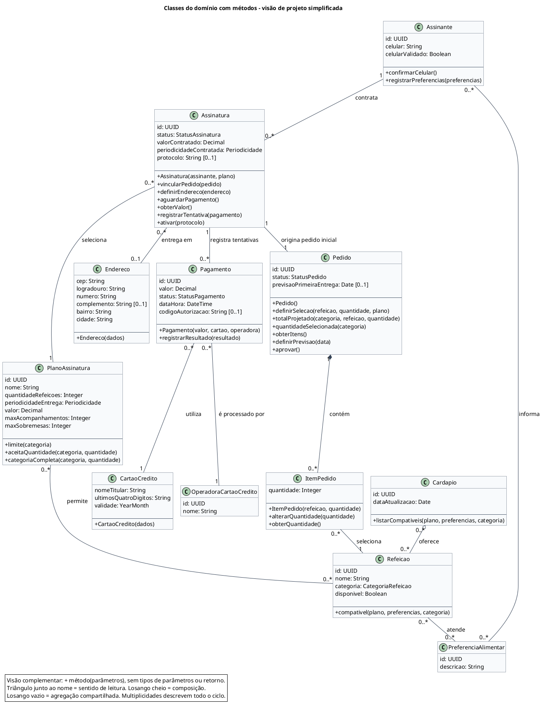
```plantuml
@startuml
!pragma layout smetana
skinparam backgroundColor #FFFFFF
skinparam defaultFontName Arial
skinparam defaultFontSize 14
skinparam shadowing false
skinparam roundcorner 0
skinparam ArrowColor #334155
skinparam sequenceMessageAlign left
skinparam sequenceParticipant underline
skinparam maxMessageSize 260
skinparam ParticipantPadding 18
skinparam BoxPadding 12
skinparam classAttributeIconSize 0
skinparam classBackgroundColor #F8FAFC
skinparam classBorderColor #475569
skinparam sequenceLifeLineBorderColor #94A3B8
skinparam sequenceParticipantBackgroundColor #EFF6FF
skinparam sequenceGroupBackgroundColor #F8FAFC
hide footbox

title Classes do domínio com métodos - visão de projeto simplificada
hide empty members
skinparam nodesep 65
skinparam ranksep 90
class Assinante {
id: UUID
celular: String
celularValidado: Boolean

--
+confirmarCelular()
+registrarPreferencias(preferencias)
}
class PlanoAssinatura {
id: UUID
nome: String
quantidadeRefeicoes: Integer
periodicidadeEntrega: Periodicidade
valor: Decimal
maxAcompanhamentos: Integer
maxSobremesas: Integer

--
+limite(categoria)
+aceitaQuantidade(categoria, quantidade)
+categoriaCompleta(categoria, quantidade)
}
class Assinatura {
id: UUID
status: StatusAssinatura
valorContratado: Decimal
periodicidadeContratada: Periodicidade
protocolo: String [0..1]

--
+Assinatura(assinante, plano)
+vincularPedido(pedido)
+definirEndereco(endereco)
+aguardarPagamento()
+obterValor()
+registrarTentativa(pagamento)
+ativar(protocolo)
}
class PreferenciaAlimentar {
id: UUID
descricao: String
}
class Cardapio {
id: UUID
dataAtualizacao: Date

--
+listarCompativeis(plano, preferencias, categoria)
}
class Refeicao {
id: UUID
nome: String
categoria: CategoriaRefeicao
disponivel: Boolean

--
+compativel(plano, preferencias, categoria)
}
class Pedido {
id: UUID
status: StatusPedido
previsaoPrimeiraEntrega: Date [0..1]

--
+Pedido()
+definirSelecao(refeicao, quantidade, plano)
+totalProjetado(categoria, refeicao, quantidade)
+quantidadeSelecionada(categoria)
+obterItens()
+definirPrevisao(data)
+aprovar()
}
class ItemPedido {
quantidade: Integer

--
+ItemPedido(refeicao, quantidade)
+alterarQuantidade(quantidade)
+obterQuantidade()
}
class Endereco {
cep: String
logradouro: String
numero: String
complemento: String [0..1]
bairro: String
cidade: String

--
+Endereco(dados)
}
class Pagamento {
id: UUID
valor: Decimal
status: StatusPagamento
dataHora: DateTime
codigoAutorizacao: String [0..1]

--
+Pagamento(valor, cartao, operadora)
+registrarResultado(resultado)
}
class CartaoCredito {
nomeTitular: String
ultimosQuatroDigitos: String
validade: YearMonth

--
+CartaoCredito(dados)
}
class OperadoraCartaoCredito {
id: UUID
nome: String
}
Assinante "1" -- "0..*" Assinatura : contrata >
Assinatura "0..*" -- "1" PlanoAssinatura : seleciona >
Assinante "0..*" -- "0..*" PreferenciaAlimentar : informa >
Assinatura "1" -- "1" Pedido : origina pedido inicial >
Assinatura "0..*" -- "0..1" Endereco : entrega em >
Pedido "1" *-- "0..*" ItemPedido : contém >
ItemPedido "0..*" -- "1" Refeicao : seleciona >
Cardapio "0..*" o-- "0..*" Refeicao : oferece >
PlanoAssinatura "0..*" -- "0..*" Refeicao : permite >
Refeicao "0..*" -- "0..*" PreferenciaAlimentar : atende >
Assinatura "1" -- "0..*" Pagamento : registra tentativas >
Pagamento "0..*" -- "1" CartaoCredito : utiliza >
Pagamento "0..*" -- "1" OperadoraCartaoCredito : é processado por >
legend bottom left
Visão complementar: + método(parâmetros), sem tipos de parâmetros ou retorno.
Triângulo junto ao nome = sentido de leitura. Losango cheio = composição.
Losango vazio = agregação compartilhada. Multiplicidades descrevem todo o ciclo.
endlegend
@enduml
```

## dominio

Abrir fonte

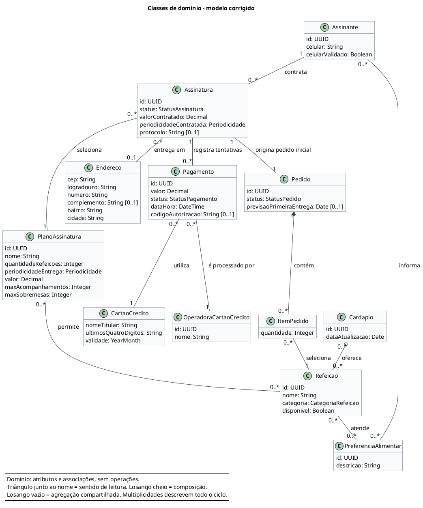
```plantuml
@startuml
!pragma layout smetana
skinparam backgroundColor #FFFFFF
skinparam defaultFontName Arial
skinparam defaultFontSize 14
skinparam shadowing false
skinparam roundcorner 0
skinparam ArrowColor #334155
skinparam sequenceMessageAlign left
skinparam sequenceParticipant underline
skinparam maxMessageSize 260
skinparam ParticipantPadding 18
skinparam BoxPadding 12
skinparam classAttributeIconSize 0
skinparam classBackgroundColor #F8FAFC
skinparam classBorderColor #475569
skinparam sequenceLifeLineBorderColor #94A3B8
skinparam sequenceParticipantBackgroundColor #EFF6FF
skinparam sequenceGroupBackgroundColor #F8FAFC
hide footbox

title Classes de domínio - modelo corrigido
hide empty members
skinparam nodesep 65
skinparam ranksep 90
class Assinante {
id: UUID
celular: String
celularValidado: Boolean
}
class PlanoAssinatura {
id: UUID
nome: String
quantidadeRefeicoes: Integer
periodicidadeEntrega: Periodicidade
valor: Decimal
maxAcompanhamentos: Integer
maxSobremesas: Integer
}
class Assinatura {
id: UUID
status: StatusAssinatura
valorContratado: Decimal
periodicidadeContratada: Periodicidade
protocolo: String [0..1]
}
class PreferenciaAlimentar {
id: UUID
descricao: String
}
class Cardapio {
id: UUID
dataAtualizacao: Date
}
class Refeicao {
id: UUID
nome: String
categoria: CategoriaRefeicao
disponivel: Boolean
}
class Pedido {
id: UUID
status: StatusPedido
previsaoPrimeiraEntrega: Date [0..1]
}
class ItemPedido {
quantidade: Integer
}
class Endereco {
cep: String
logradouro: String
numero: String
complemento: String [0..1]
bairro: String
cidade: String
}
class Pagamento {
id: UUID
valor: Decimal
status: StatusPagamento
dataHora: DateTime
codigoAutorizacao: String [0..1]
}
class CartaoCredito {
nomeTitular: String
ultimosQuatroDigitos: String
validade: YearMonth
}
class OperadoraCartaoCredito {
id: UUID
nome: String
}
Assinante "1" -- "0..*" Assinatura : contrata >
Assinatura "0..*" -- "1" PlanoAssinatura : seleciona >
Assinante "0..*" -- "0..*" PreferenciaAlimentar : informa >
Assinatura "1" -- "1" Pedido : origina pedido inicial >
Assinatura "0..*" -- "0..1" Endereco : entrega em >
Pedido "1" *-- "0..*" ItemPedido : contém >
ItemPedido "0..*" -- "1" Refeicao : seleciona >
Cardapio "0..*" o-- "0..*" Refeicao : oferece >
PlanoAssinatura "0..*" -- "0..*" Refeicao : permite >
Refeicao "0..*" -- "0..*" PreferenciaAlimentar : atende >
Assinatura "1" -- "0..*" Pagamento : registra tentativas >
Pagamento "0..*" -- "1" CartaoCredito : utiliza >
Pagamento "0..*" -- "1" OperadoraCartaoCredito : é processado por >
legend bottom left
Domínio: atributos e associações, sem operações.
Triângulo junto ao nome = sentido de leitura. Losango cheio = composição.
Losango vazio = agregação compartilhada. Multiplicidades descrevem todo o ciclo.
endlegend
@enduml
```

